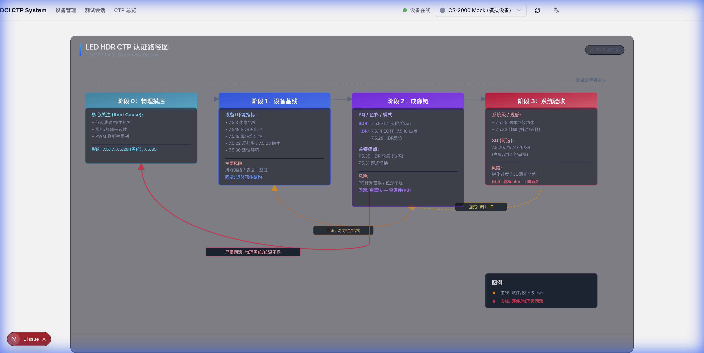
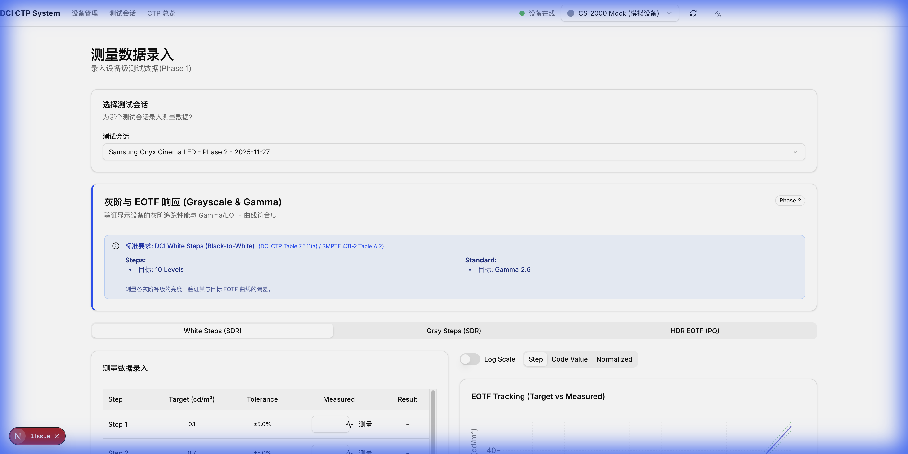
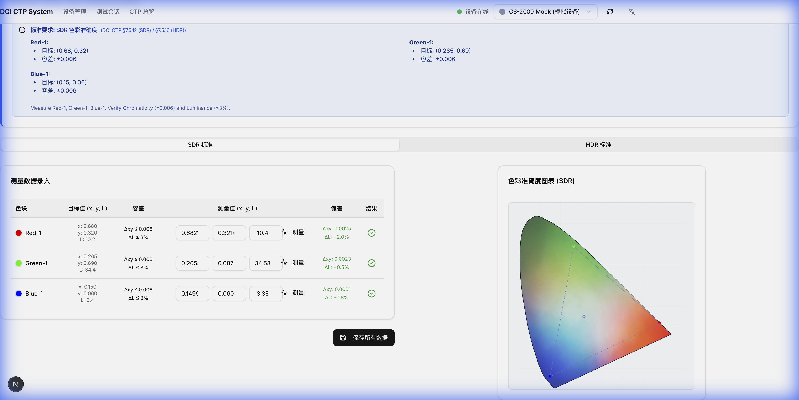
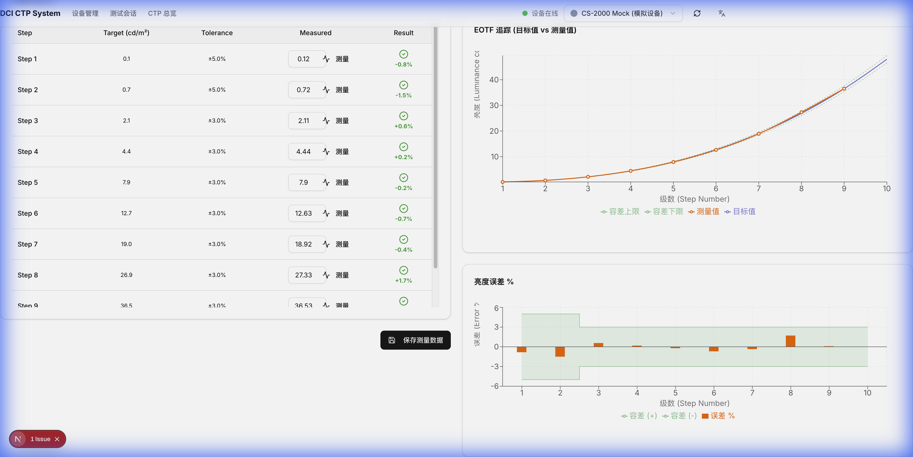
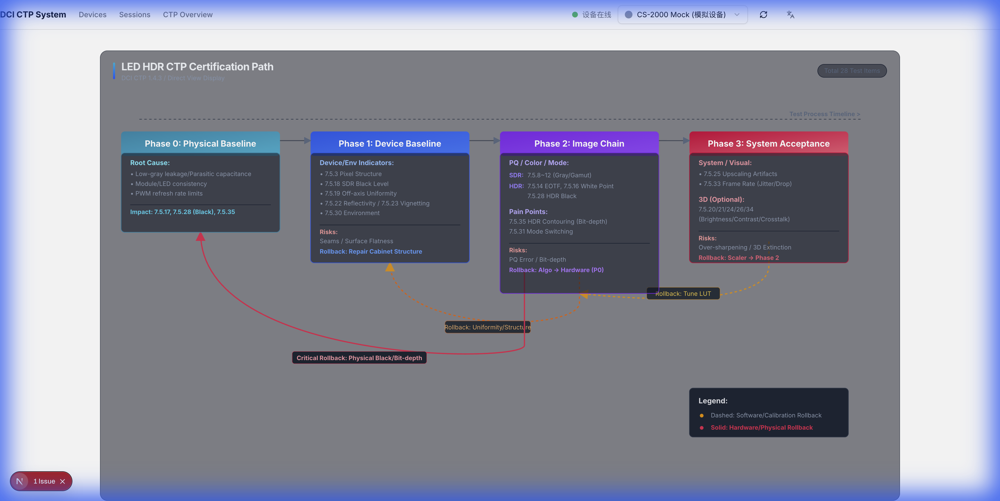
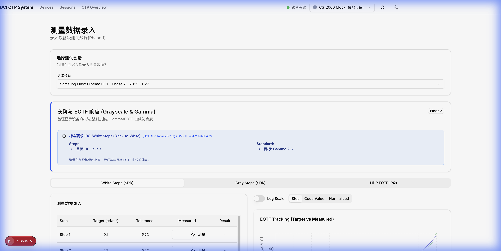
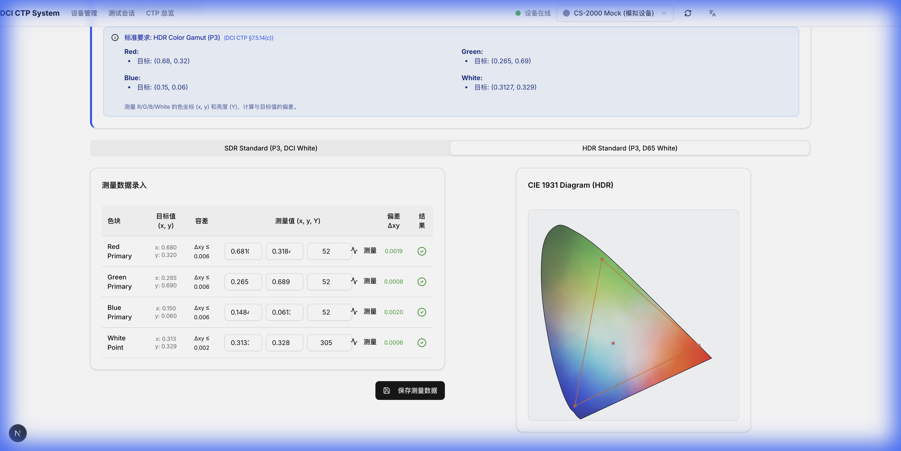
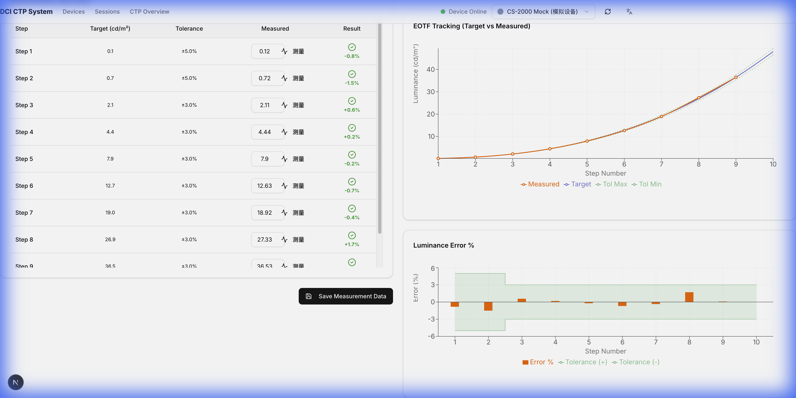

# DCI CTP Display Measurement Tool

[English](#english) | [中文](#chinese)

## 项目介绍 (Project Introduction)

**DCI CTP Display Measurement Tool** 是一个基于 Electron 和 Next.js 开发的显示设备测量与分析工具。旨在辅助专业人员进行显示设备的色彩、亮度等参数的测量（CTP - Color Test Pattern）。

本项目集成了现代化的技术栈，包括：
- **Frontend**: Next.js, React, Tailwind CSS, shadcn/ui
- **Backend/Desktop**: Electron
- **Database**: SQLite (via Drizzle ORM)

### 背景与标准 (Background & Standards)
本项目基于 **Digital Cinema Initiatives (DCI)** 的相关规范开发，严格遵循以下标准文档：
- **DCI CTP 1.4.3**: Digital Cinema System Specification Compliance Test Plan Version 1.4.3
- **DCI DCSS 1.4.5**: Digital Cinema System Specification Version 1.4.5
- **DCI Addenda**:
  - Direct View Display D-Cinema Addendum
  - High Dynamic Range D-Cinema Addendum
- **SMPTE Standards**:
  - SMPTE 431-1:2006 (Screen Luminance Level, Chromaticity and Uniformity)
  - SMPTE RP 431-2:2011 (Reference Projector and Environment)
- **ICDM IDMS**: Information Display Measurements Standard

项目旨在为符合上述标准的显示设备（包括直视型显示器和 HDR 影院系统）提供自动化的测量与合规性验证工具。

### 主要功能
- **主界面**: 提供直观的仪表盘，概览设备状态和测量任务。
- **测试界面**: 提供详细的测量工具和参数配置，支持多种测试模式。
- **数据管理**: 本地存储测量数据，支持历史记录查询。

## 下载链接 (Download)

> [!NOTE]
> 当前版本为开发预览版。
> Current version is a development preview.

- **Download Latest Version**: [GitHub Releases](https://github.com/zhangzhangco/dci-ctp/releases)
  - **macOS**: `DCI CTP.dmg`
  - **Windows**: `DCI CTP Setup.exe`
  - **Linux**: `DCI CTP.AppImage`

> [!NOTE]
> 这些链接指向最新发布的版本。
> These links point to the latest released version.

> [!TIP]
> 也可以访问 [Releases 页面](https://github.com/zhangzhangco/dci-ctp/releases) 查看所有版本。
> You can also visit the [Releases Page](https://github.com/zhangzhangco/dci-ctp/releases) for all versions.

## 界面预览 (Screenshots)

### 主界面 (Main Interface)
*(在此处插入主界面截图)*

### 测试界面 (Test Interface)
*(在此处插入测试界面截图)*

### 本地化界面 (Localized Interface)
#### 色彩准确度 (Color Accuracy)

#### 灰阶传递函数 (Grayscale)

## 免责声明 (Disclaimer)

> [!WARNING]
> **请仔细阅读以下内容 / Please read carefully:**

本项目目前处于**开发阶段**，功能尚不完善。
1. **不承担风险**: 使用本软件产生的任何后果（包括但不限于数据丢失、设备损坏等），开发者不承担任何责任。
2. **功能未完成**: 部分功能可能尚未开发完成或未经充分测试，可能存在 Bug。
3. **无长期维护**: 本项目仅用于**研究和学习**目的，不承诺提供长期的维护、更新或技术支持。

---

## Project Introduction

**DCI CTP Display Measurement Tool** is a display measurement and analysis tool built with Electron and Next.js. It is designed to assist professionals in measuring display parameters such as color and brightness (CTP - Color Test Pattern).

This project leverages a modern tech stack:
- **Frontend**: Next.js, React, Tailwind CSS, shadcn/ui
- **Backend/Desktop**: Electron
- **Database**: SQLite (via Drizzle ORM)

### Background & Standards
This project is developed based on the specifications from **Digital Cinema Initiatives (DCI)** and strictly adheres to the following standards:
- **DCI CTP 1.4.3**: Digital Cinema System Specification Compliance Test Plan Version 1.4.3
- **DCI DCSS 1.4.5**: Digital Cinema System Specification Version 1.4.5
- **DCI Addenda**:
  - Direct View Display D-Cinema Addendum
  - High Dynamic Range D-Cinema Addendum
- **SMPTE Standards**:
  - SMPTE 431-1:2006 (Screen Luminance Level, Chromaticity and Uniformity)
  - SMPTE RP 431-2:2011 (Reference Projector and Environment)
- **ICDM IDMS**: Information Display Measurements Standard

The tool aims to provide automated measurement and compliance verification for display devices (including Direct View Displays and HDR Cinema Systems) in accordance with these standards.

### Key Features
- **Main Interface**: Provides an intuitive dashboard for an overview of device status and measurement tasks.
- **Test Interface**: Offers detailed measurement tools and parameter configurations, supporting various test modes.
- **Data Management**: Local storage of measurement data with support for history queries.

## Screenshots

### Main Interface
*(Insert Main Interface Screenshot Here)*

### Test Interface
*(Insert Test Interface Screenshot Here)*

### Localized Interface
#### Color Accuracy

#### Grayscale

## Disclaimer

> [!WARNING]
> **Important Notice:**

This project is currently in the **development stage** and is not fully feature-complete.
1. **No Liability**: The developers assume no responsibility for any consequences resulting from the use of this software (including but not limited to data loss, device damage, etc.).
2. **Incomplete Features**: Some features may not be fully developed or tested and may contain bugs.
3. **No Long-term Support**: This project is intended for **research and learning purposes only**. There is no commitment to long-term maintenance, updates, or technical support.
